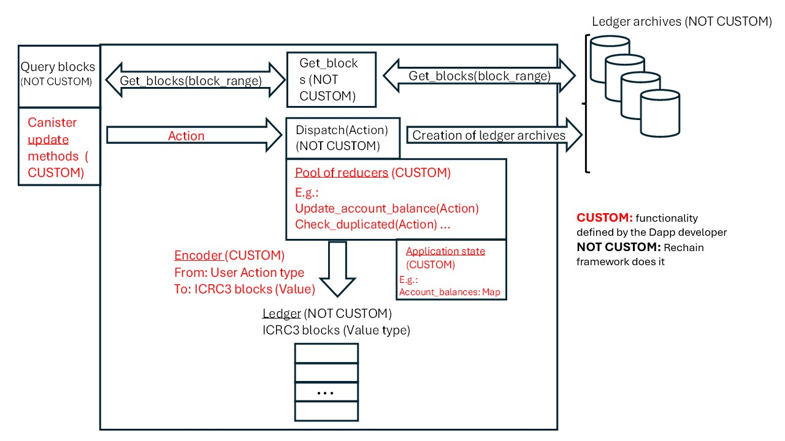
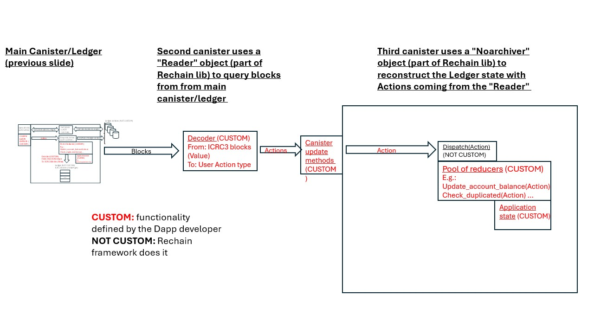

# Rechain

This Motoko library serves as a middleware framework enabling the integration of blockchain functionalities directly into dApps on the IC. It aims to abstract the complexities involved in blockchain operations, such as block creation, transaction management, hashing, certification and archival processes, allowing developers to incorporate ledger functionalities with minimal overhead.

**Core Components and Functionalities:**

- Reducer Pattern for State Management: Employs a reducer pattern to manage state transitions based on actions. This approach allows for a more structured and predictable state management process, crucial for maintaining the consistency of blockchain states. It will allow easy replaying of state.

- Has a modified stable memory version of the Sliding Window Buffer (by Research AG)

- Modularity and Extensibility: Designed with modularity at its core, the library allows developers to define custom actions, errors, and reducer functions.

- Reducer Libraries: Developers can publish their reducers as libraries, enabling others to incorporate these libraries into their canisters for efficient remote state synchronization. This process involves tracking a remote ledger's transaction log and reconstructing the required state segments in their canisters. This mechanism facilitates the development of dApps that can in certain cases can do remotely atomic synchronous operations within asynchronous environments, similar to the DeVeFi Ledger Middleware's capabilities.

- ICRC3 full campatibility: Customizable encoding/decoding from/to user specific action types to ICRC3 block type, ICRC3 block hashing, ICRC3 block ledger and ICRC3 ledger archive management (creation, retrieval and cycle management).  ICRC3 standard implementation was initially based on the the ICDev/PanIndustrial implementation (https://github.com/PanIndustrial-Org/icrc3.mo/) but with some variations:

    - The ledger is implemented with a stable sliding window buffer (https://mops.one/swbstablea) instead of a more regular vector making archiving and query operations much simpler
    - It demonstrate the use of the rechain library adding 2 reducers that are applied to every single incoming block: 1) to continuously update the balance of every ledger account, 2) to check the consistency of the block creation time and the possible existence of a duplicated block
    - In the ICDev/PanIndustrial implementation, if ledger exceeded its max length, it was setting a timer to run in the next round to run the archive. We instead run a recurrent timer that checks every 30 seconds whether we need to create an archive.
    - Recurrent timer (every 6 hours) that checks all archive canister cycle balances and refills them with X amount of cycles if they dropped bellow Y unless the main canister is bellow Z (X,Y,Z are settings)

**Examples:**

Use case 1: How to add ledger functionalities to your dapps/canisters



Use case 2: How to replicate the Dapp/canister state evolution up to a given time



Examples of both cases can be found [here](https://github.com/Neutrinomic/rechain/tree/master/test "Rechain tests using PocketIC")

**Installation and test:**

1) Make sure node is installed (version 21.4 or superior): `> nvm 21.4`
```
nvm 21.4
go to test
yarn
built
```